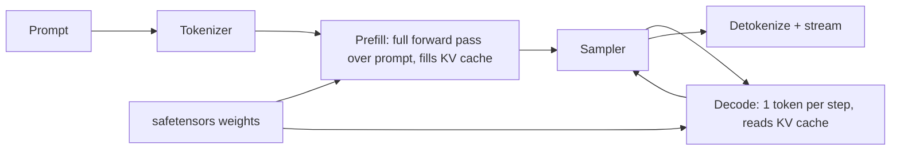

# infer

A from-scratch Llama-family LLM inference engine: hand-written transformer forward pass, KV cache, sampling, continuous batching, and an OpenAI-compatible streaming HTTP API.

The runtime depends on PyTorch for tensor math, `safetensors` / `tokenizers` / `huggingface_hub` for checkpoints, and FastAPI for serving. Model code, caching, scheduling, and the API are implemented in this repo.

## What it does



Supported architectures: Llama, Qwen2, and Mistral-style decoder-only models (RMSNorm, RoPE, GQA, SwiGLU). Default demo checkpoint: [`Qwen/Qwen2.5-0.5B-Instruct`](https://huggingface.co/Qwen/Qwen2.5-0.5B-Instruct), which runs on CPU.

## Install

Python 3.12–3.14. PyTorch 2.14 is recommended (`torch.compile` works on 3.14; 3.15 is eager-only).

```bash
uv sync --extra dev
```

GPU (optional): install a CUDA wheel from [pytorch.org](https://pytorch.org/get-started/locally/), then the engine will pick `cuda` + `bfloat16` automatically.

## Run

```bash
# Interactive chat (downloads the default 0.5B instruct model on first run)
uv run infer chat

# Single prompt
uv run infer chat --prompt "Write a haiku about compilers." --temperature 0.7

# OpenAI-compatible server
uv run infer serve --host 127.0.0.1 --port 8000
```

Against the server:

```bash
curl http://127.0.0.1:8000/health

curl http://127.0.0.1:8000/v1/chat/completions \
  -H "Content-Type: application/json" \
  -d '{
    "model": "Qwen/Qwen2.5-0.5B-Instruct",
    "messages": [{"role": "user", "content": "Say hello in one sentence."}],
    "max_tokens": 64,
    "temperature": 0.7,
    "stream": true
  }'
```

Python client:

```python
from openai import OpenAI

client = OpenAI(base_url="http://127.0.0.1:8000/v1", api_key="not-needed")
print(client.chat.completions.create(
    model="Qwen/Qwen2.5-0.5B-Instruct",
    messages=[{"role": "user", "content": "Hello!"}],
).choices[0].message.content)
```

## Benchmarks

```bash
uv run infer bench --prompt-len 64 --gen-len 64
uv run python benchmarks/bench_decode.py --tiny
```

Numbers below are from the synthetic tiny model on CPU (no downloaded weights). Re-run `infer bench` on a real checkpoint to fill the last rows on your machine.

| Device | Dtype | Compile | Prompt | Gen | Prefill tok/s | Decode tok/s | Notes |
| --- | --- | --- | --- | --- | --- | --- | --- |
| cpu | float32 | no | 64 | 64 | (run `--tiny`) | (run `--tiny`) | 2-layer 64-d toy model |
| cpu | float32 | no | 64 | 64 | (run `infer bench`) | (run `infer bench`) | Qwen2.5-0.5B-Instruct |
| cuda | bfloat16 | yes | 64 | 64 | (run `infer bench --compile`) | (run `infer bench --compile`) | GPU, if present |

`--compile` wraps the module in `torch.compile`. `--dtype bfloat16` is the GPU default; CPU stays float32 unless you override it.

## Tests

```bash
uv run pytest
```

Layer, cache, sampling, scheduler, and API tests use a tiny random network. Logits / greedy checks against Hugging Face `transformers` run when that extra is installed (it is part of `--extra dev`).

## Layout

```
src/infer/
  config.py          # ModelConfig from HF config.json
  weights.py         # snapshot download + safetensors load
  tokenizer.py       # tokenizer.json + Jinja chat template
  model/layers.py    # RMSNorm, RoPE, GQA attention, SwiGLU
  model/llama.py     # decoder-only LM, prefill and decode share forward()
  kv_cache.py        # slot-based KV cache
  sampling.py        # greedy, temperature, top-k, top-p, repetition penalty
  engine.py          # prefill / decode / generate
  scheduler.py       # continuous batching
  server/            # FastAPI OpenAI-compatible API
  cli.py             # infer chat | serve | bench
```

## Docker

```bash
docker build -t infer .
docker run --rm -p 8000:8000 infer serve --host 0.0.0.0 --port 8000 --model Qwen/Qwen2.5-0.5B-Instruct
```
